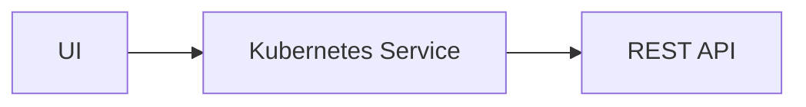

# Hello Armory Tutorial

Welcome to Armory CDaaS! In this tutorial for CDaaS beginners, you'll accomplish the following:

- Deploy Armory's sample application `potato-facts` to two environments.
- Use Armory cloud console to approve an environment promotion.
- Observe a traffic split between two application versions.
- Learn CDaaS deployment YAML syntax.

### Before you begin

Before you begin, make sure you have completed the following:

- Installed the `armory` CLI
- Connected your Kubernetes cluster with an Armory agent

If you haven't completed these steps (or don't know what they mean!), follow the [Getting Started Guide](../README.md), 
then head straight back to this guide.

## First deployment

Armory's sample application `potato-facts` is a simple web application.

The web UI polls the API backend for facts about potatoes and renders them for users.
