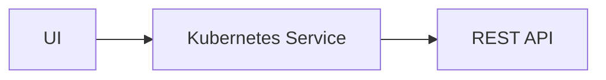

# Hello Armory Tutorial

Welcome to Armory CDaaS! In this tutorial for CDaaS beginners, you'll accomplish the following:

- Deploy Armory's sample application `potato-facts` to staging and production.
- Use Armory cloud console to approve an environment promotion.
- Observe a traffic split between two application versions.
- Learn CDaaS deployment YAML syntax.

### Before you begin

Before you begin, clone this repository.

You should also make sure you have completed the following:

- Installed the `armory` CLI.
- Logged in to or signed up for your free Armory CDaaS account using `armory login`.
- Connected your Kubernetes cluster with an Armory agent. Your agent will have an identifier `<my-agent-identifier>` that will be referenced throughout this tutorial.

If you haven't completed these steps (or don't know what they mean!), follow the [Getting Started Guide](../README.md), 
then head straight back to this tutorial.

## First deployment

Armory's sample application `potato-facts` is a simple web application:



The web UI polls the API backend for facts about potatoes and renders them for users.

### Deploy

From this directory, run the following command:

```shell
armory deploy start -f ./first-deployment.yaml -a <my-agent-identifier>
```

Congratulations, you've just started your first deployment with CDaaS!

### Deployment YAML

Your application is now being deployed in two Kubernetes namespaces. Use this time to familiarize yourself with 
CDaaS's deployment YAML. 

### `targets`

In CDaaS, a `target` is an `(account, namespace)` pair, where the account is the name of your agent identifier. 

When deploying to multiple targets, you can specify dependencies between targets 
using the `constraints.dependsOn` field. In the case of this tutorial, the `prod` deployment will start only when the `staging`
deployment has completed successfully.

```yaml
targets:
  staging:
    # Account is optional when passed as a CLI flag (-a or --account).
    # It's also required if you'd like to deploy to multiple Kubernetes clusters.
    # account: <my-agent-identifier> 
    namespace: potato-facts-staging
    strategy: rolling
  prod:
    namespace: potato-facts-prod
    strategy: rolling
    constraints:
      dependsOn: ["staging"]
```

### `manifests`

CDaaS can deploy any Kubernetes manifest. You do not need to alter your manifests or apply any special annotations to use CDaaS.

By default, the manifests defined in `path` will be deployed to all of your `targets`. If you want to restrict the targets where a manifest 
should be deployed, use the `manifests.targets` field.

A `path` can be a path to an individual file or a directory.

```yaml
manifests:
  - path: ./manifests/potato-facts.yaml
  - path: ./manifests/staging-namespace.yaml
    targets: ["staging"]
  - path: ./manifests/prod-namespace.yaml
    targets: ["prod"]
```

### `strategies`

A `strategy` defines how manifests are deployed to a target. 

A `canary`-type strategy is a linear sequence of steps. The `setWeight` step defines the ratio of traffic
between application versions. This tutorial will introduce other step types later on.

CDaaS integrates with service meshes like Istio and Linkerd,
but you do not need to use a service mesh to use a CDaaS `canary` strategy.

```yaml
strategies:
  rolling:
    canary:
      steps:
        # This strategy immediately flips all traffic to the new application version.
        - setWeight:
            weight: 100
```